# R-CNN系列笔记

## 1. RCNN算法流程

1. 使用Selective Search方法对一张图像选取1k~2k个候选区域(proposal)
2. 对于每个候选区域，将图片的那个部分截取出来送进**CNN**- backbone中进行特征抽取
3. 将特征送入每一类**SVM分类器**中，判断是否属于该类
4. 使用**回归器精细化边界框**

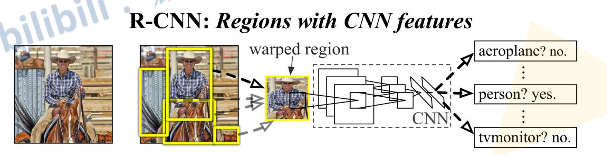

### 1.1候选区域生成

​	利用**Selective Search**算法通过图像分割的方法得到一些原始区域，然后使用一些合并策略将这些区域合并，得到一个层次化的区域结构，而这些结构就包含着可能需要的物体,如下图向日葵

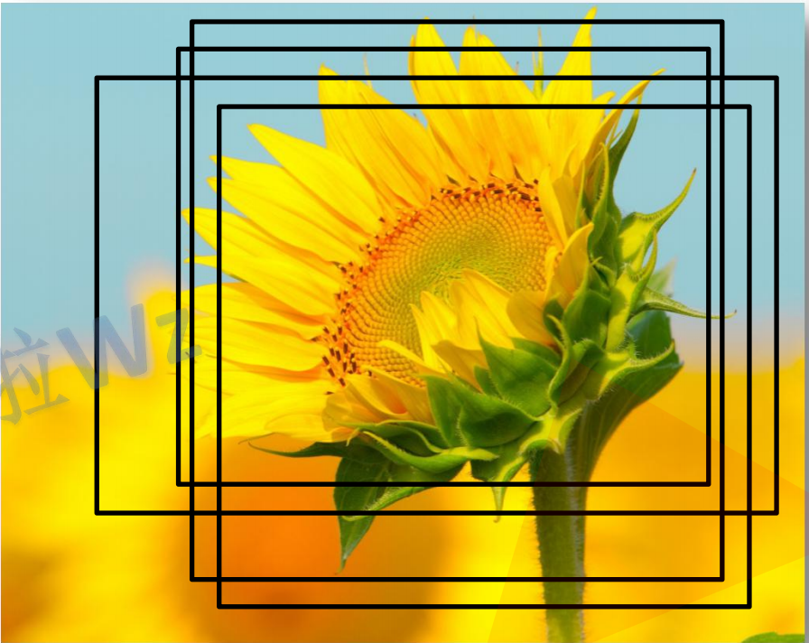

### 1.2对候选区域使用深度神经网络提取特征

​	这部分的操作是对于每个候选区域**（2k个）**，把他从图片中拿出来然后**resize**为$227 \times 227$大小，然后使用AlexNet等CNN网络抽取特征，每个候选区域都变成了一个4096维的向量，得到一个$2000 \times 4096$大小的矩阵

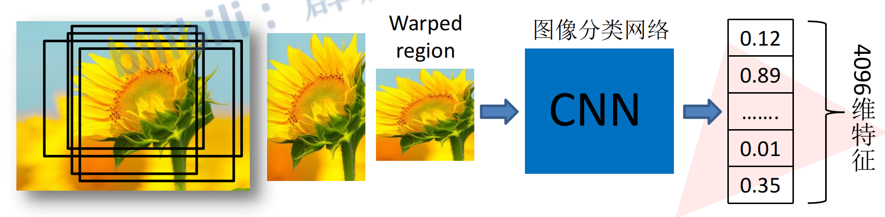

### 1.3将每一个候选区域特征送入SVM分类器，判定类别

​	将$2000\times 4096$的矩阵与20个SVM组成的权值矩阵$4096 \times 20(\text{cls of pascal VOC})$相乘，得到$2000 \times 20$的类别分数矩阵，每一行代表这个proposal对于每个类别的分数，每一列代表这一类中对于不同proposal的分数，由于这2000个proposal中有很多重复的框，所以我们对每一列使用**NMS**进行抑制，去除重复框，得到一些高质量的建议框	

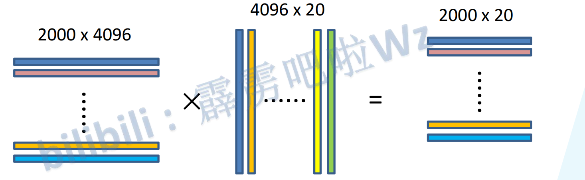

#### NMS算法流程图

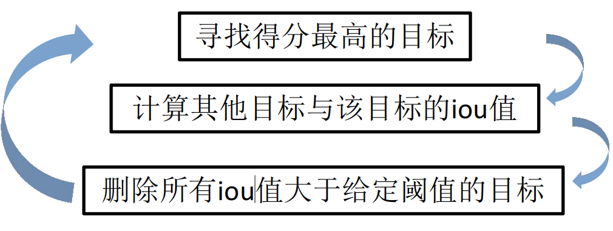

​	就是对于每一列，例如猫这个类，找到分数最大的框，然后设置iou阈值为0.5，然后计算其他框与这个框的iou，如果大于阈值，证明这两个框很有可能是同一个框，就把分数小的那个过滤掉，反复进行，直到没有重复框

### 1.4**使用回归器精细修正候选框位置**

​	对剩下的框，针对feature map，使用回归器进行优化调整

----------

## 2 Fast-RCNN

1. 使用selective search(SS 算法)对一张图片生成**1k ~ 2k个候选区域**
2. 将图像输入backbone得到相应的**特征图**，将SS算法得到的候选区域投影到特征图上获得相应的**特征矩阵**
   1. 就是说候选框是按照原始图片比例生成，对于feature map也可以按照对应的比例得到候选区域的特征图
3. 将每个特征矩阵经过**RoI pooling**层(Region of Interest)之后得到一个$7 \times 7$大小的特征图，然后将特征图展平，然后经过全连接层得到检测结果

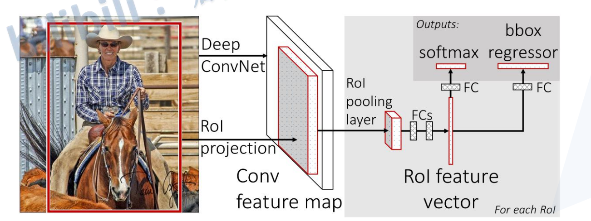

### 2.1 候选区域生成（同RCNN）

-----

### 2.2 一次性得到整张特征图

​	R-CNN中有一个很重要的因素影响模型速度，那就是候选区域有很多重叠的部分，如果把图片的候选区域提取出来再送到骨干网络中会产生很多冗余的计算，所以在Fast-RCNN中，将一次性得到整张特征图，然后把候选区域框投影到特征图上，得到候选区域的特征

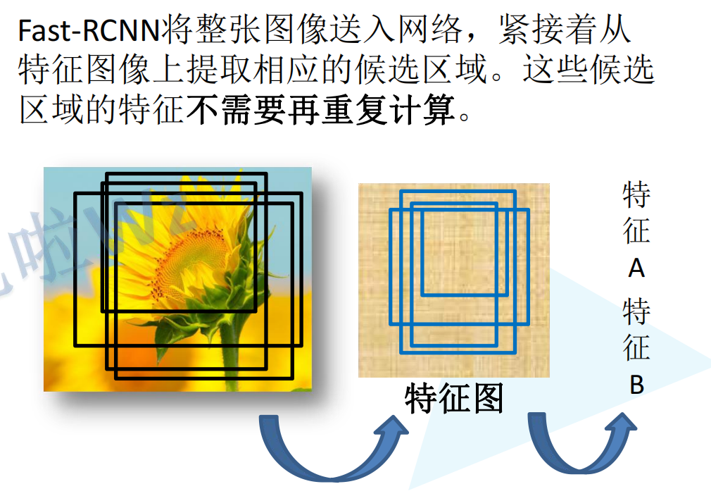

### 2.3 采样（翻译自原论文）

​	一个mini-batch中，对于每张图片选出64个RoIs，选出与gt box的IoU大于0.5的那些候选区域的25%作为正样本RoI，剩下$\frac{3}{4}$的RoIs在与Gt box的IoU在$[0.1, 0.5)$之间的候选区域中采样选出，然后剩下的就直接不管了.

### 2.4 RoI Pooling 层

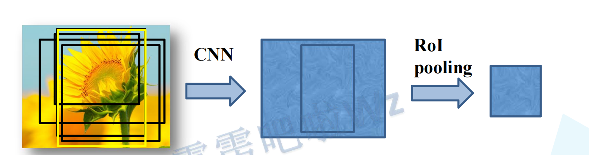

​	说的直白一些，RoI Pooling层就是将RoI Resize成$7 \times 7$的大小，类似把你的特征图宽高都分成7份，打出了$7\times 7$个格子，然后在每个格子里做和格子一样大小的最大池化，就得到了$7 \times 7$的特征图，具体例子见下图

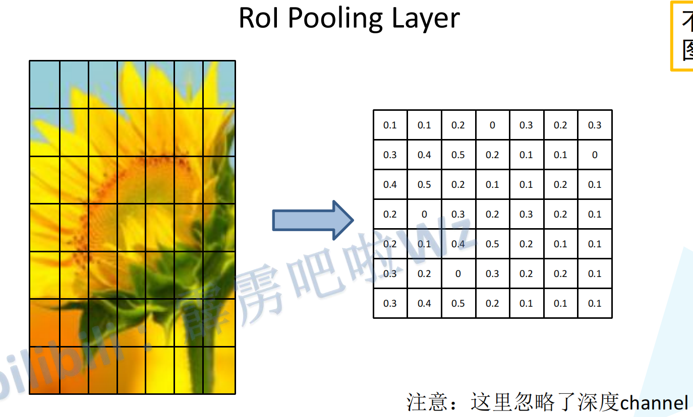

### 2.5 分类器

​	对于每个RoI，得到了一个特征向量，将他送到分类器中得到我们的分类回归结果，假设我们数据集中有$N$个类，那么我们要预测$N + 1$个结果，其中第0个结果代表背景类，这样就得到了每个RoI的类别信息，下图是以Pascal VOC的类别举例，有20个类

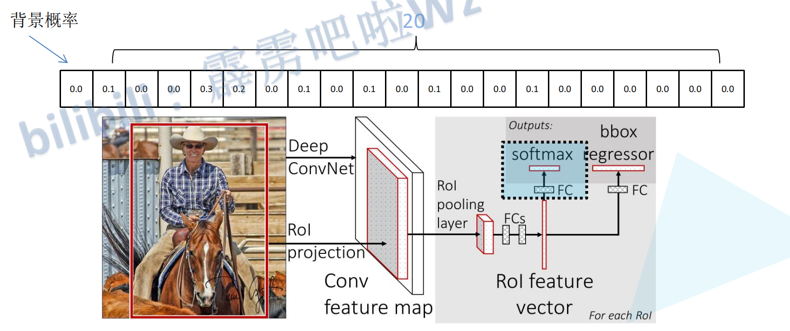

### 2.6 边界框回归器

​	输出$N + 1$个类别的**边界框回归参数**（==注意这里是边界框回归参数，不是边界框，也就是说要通过这个参数去得到边界框==）$(d_x, d_y, d_w, d_h)$,共$(N + 1) \times 4$个输出值，每个RoI的每个类别都对应一组边界框回归参数

#### 	如何通过==边界框回归参数==得到边界框呢？

​		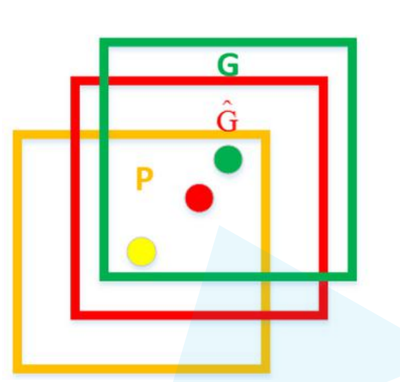	在这张图中，$G$表示真实框，GT box， $P$表示候选区域，也就是RoI，$\hat{G}$是网络最终预测的框

​		$$\hat{G_x} = P_wd_x + P_x \\ \hat{G_y} = P_hd_y + P_y \\ \hat{G_w} = P_w \exp(d_w) \\ \hat{G_h} = P_h \exp(d_h)$$	

​	其中$P_x, P_y, P_w, P_h$是候选区域的边界框参数，$\hat{G_x},\hat{G_y},\hat{G_w},\hat{G_h}$为最终预测的边界框的$xywh$

### 2.7 损失函数

损失函数由**分类损失**和**框回归损失**构成

$$L(p,u,t^u,v) = L_{cls}(p,u) + \lambda[u \geq 1]L_{bbox}(t^u, v)$$

- $p$为softmax预测概率$p = (p_1, p_2, \cdots, p_k)$
- $u$为目标真是类别标签索引
- $t^u$为目标框预测的对应类别$u$的回归参数$(t_x^u, t_y^u,t_w^u,t_h^u)$，因为没必要计算其他类别的框回归损失
- $v$对应真实标注框的回归参数$(v_x,v_y,v_w,v_h)$,从上面的公式逆运算得出

- 其中$L_{cls}$就是交叉熵损失$L_{CE}(p, u) = -\log(p_u)$
- $L_{bbox}$使用$smooth_{L_1}$损失，即$L_{bbox} = \sum_{i \in \{x,y,w,h\}}{\text{smooth}_{L_1}(t_i^u,v_i)}$其中

$$\text{smooth}_{L_1}(x) = 
\begin{cases} 
0.5x^2 & \text{if } |x| < 1, \\
|x| - 0.5 & \text{otherwise}.
\end{cases}$$

## 3. Faster-RCNN

​	Fast-RCNN听名字很Fast，但是其实也不快，主要是因为SS算法生成候选区域的时间没有被优化，仍然需要2s左右的时间，虽然GPU上的推理时间优化了很多，但是整体时间还是不够快，所以将生成候选区域融入到网络中，进一步提高推理速率，就得到了Faster-RCNN,所以Faster-RCNN整体上就是**RPN + Fast-RCNN**

1. 将输入图片输入到输入到网络得到**整张图片的特征图**
2. 使用**RPN(Region Proposal Network)**生成候选区域，将RPN生成的候选区域投影到特征图上得到相应的投影矩阵，
3. 将每个特征矩阵经过**RoI Pooling**层之后缩放到$7 \times 7$大小的矩阵，送入分类器和回归器

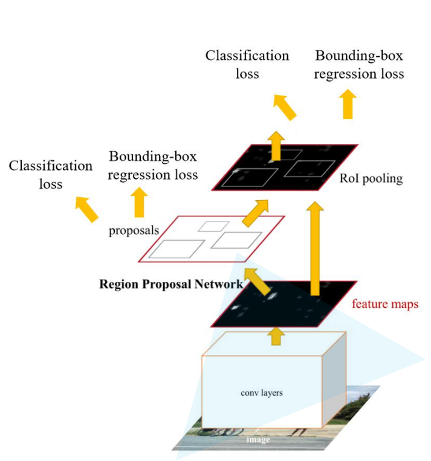

### 3.1 Region Proposal Network

​	首先backbone抽取出来的特征图被送进区域提议网络中，对于特征图上的每个$3 \times 3$的窗口，通过**感受野**计算出滑动窗口的中心在原图像中的中心点位置，并计算出k个**anchor box(不是proposal，anchor box经过refine 之后选一部分作为proposal)**

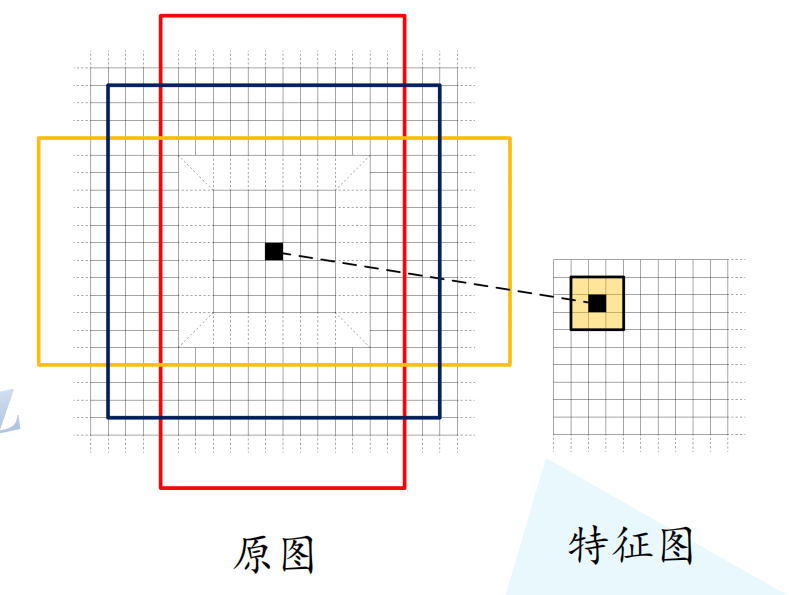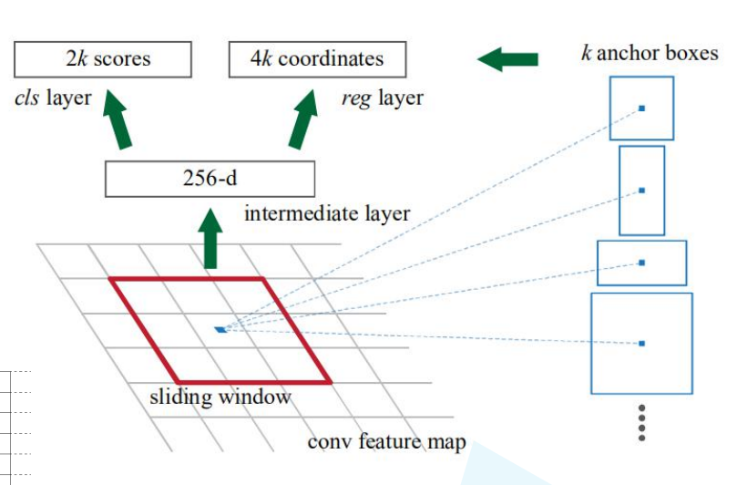

##### **感受野的计算**

$$F(i) = (F(i + 1) - 1) \times Stride \space + \space KernelSize$$

​	选用的锚框的的比例选取为$\{1:1, 1:2, 2:1\}$,在原图上对应三个面积$\{128^2, 256^2, 512^2\}$,这样每个位置在原图上都有$3 \times 3 = 9$个锚框

--------------------

​	将这个位置的anchor送入检测器中，会得到这个位置所有anchor的得分以及框回归参数，得分的大小表示这个anchor中有物体的概率大小，框回归参数是为了微调anchor使得它更加高质量的尽可能圈住物体，假设一个位置会出现k个锚框，那么分类器会预测2k个值，回归器会预测4k个值。

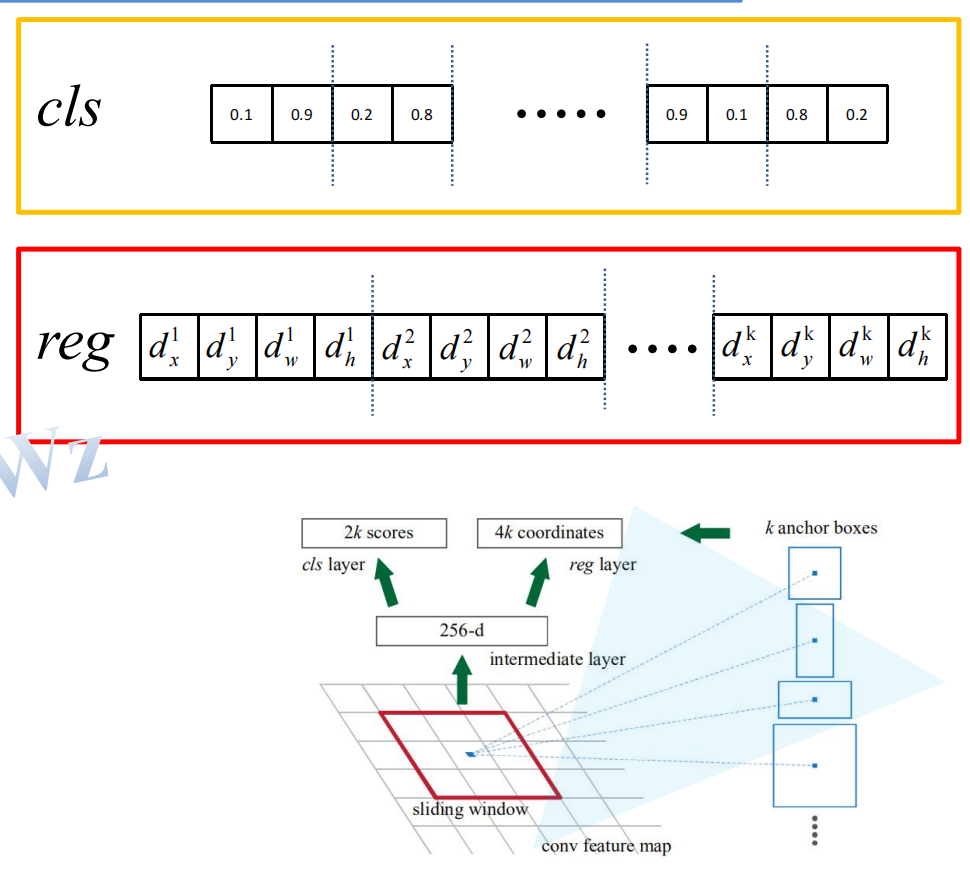

​	对于一张$1000 \times600\times3$的图像，大约有$60\times40\times9(20k)$个anchor，忽略跨越边界的anchor以后，剩下约6k个anchor。对于RPN生成的候选框之间存在大量重叠，基于候选框的*cls*得分，采用非极大值抑制，IoU设为0.7，这样每张图片只剩2k个候选框。

### 3.2 采样

​	每个batch中都要从图像中选取正例和负例，因为一个图片中还是有很多的区域提示框（2k），这其中有绝大部分都是负例框，如果全部都用来refine和计算损失，那么会导致负例占主导地位，使得模型优化很慢，甚至无法优化，因此为了解决这个问题，我们从每张图片中选择256个anchors作为正例和负例，比例为1：1，如果正例不够，就用负例补齐。

​	正例是那些与gt框的IoU大于0.7的框或者不满足这种情况时，IoU最大的框就是正例，如果IoU小于0.3，那么称之为负例，中间的那些框就不用管了，直接扔掉了

### 3.3 RPN网络损失

​	RPN网络的损失也是由分类损失和边界框回归损失构成

$$L(p_i, t_i) = \frac{1}{N_{cls}}\sum_{i}{L_{cls}(p_i, p_i^{\star})} + \lambda\frac{1}{N_{reg}}\sum_{i}{p_i^{\star}L_{bbox}(t_i, t_i^{\star})}$$

其中：

- $p_i$是第i个anchor的预测是否有物体的概率
- $p_i^{\star}$是标注信息，正样本时为1，负样本时为0
- $t_i$表示第i个anchor的回归参数
- $t_i^{\star}$表示第i个anchor对应的gt框的回归参数
- $N_{cls}$表示一个batch中样本数量，256
- $N_{reg}$表示anchor==位置(不是anchor数量)==的个数，约2400
- $L_{cls}$为交叉熵损失
- $L_{bbox}$为$\text{smooth}_{L_1}$损失

### 3.4 Faster-RCNN损失

同Fast-RCNN的损失
