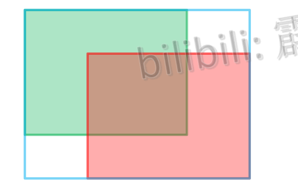

# YOLO系列笔记

==注：本笔记的图片均来自[霹雳吧啦Wz](https://space.bilibili.com/18161609/channel/index)==,此博主讲的巨好，推荐大家去看

## 1. YOLOv1

### 1.1 基本思想

​	把一张图片打成$S \times S$个网格，每个网格负责预测$B$个边界框，如果标注的object的标注框的中心点落在了这个grid cell（网格）中，那么这个网格就负责预测这个物体

​	每个网格要预测$B$个bounding box，每个bounding box预测5个参数，分别是位置参数$\{x, y, w,h\}$以及confidence值，这个confidence值根据论文里面的表述，这个值表示这个框有多大的把握预测**这个框里有物体**，以及这个**框的定位有多准**，所以计算公式为$\text{confidence} = \Pr(object) * \text{IoU}_{pred}^{truth}$,IoU是计算预测框与真实框的IoU

### 1.2 网络结构

​	YOLOv1的骨干网络作者并没有起一个具体的名字，以下网络结构图来自原论文

​	首先yolov1的网络接收图片的分辨率为$448 \times 448 \times 3$然后经过以下网络结构

| 网络类型 | 卷积核个数(out channel) |      卷积核参数      |          输出大小           |
| :------: | :---------------------: | :------------------: | :-------------------------: |
|   Conv   |           64            | $7\times7\space,s=2$ |   $224\times224\times64$    |
| MaxPool  |            \            |  $2 \times 2, s=2$   | $112 \times 112 \times 64$  |
|          |                         |                      |                             |
|   Conv   |           192           |     $3 \times 3$     | $112 \times 112 \times 192$ |
| MaxPool  |            \            |  $2 \times 2, s=2$   |  $56 \times 56 \times 192$  |
|          |                         |                      |                             |
|   Conv   |           128           |     $1 \times 1$     |  $56 \times 56 \times 128$  |
|   Conv   |           256           |      $3\times3$      |    $56\times56\times256$    |
|   Conv   |           256           |      $1\times1$      |   $56\times 56\times256$    |
|   Conv   |           512           |      $3\times3$      |   $56\times 56\times512$    |
| MaxPool  |            \            |      $2\times2$      |   $28\times28 \times512$    |
|    ……    |           ……            |          ……          |             ……              |

​	经过最后的卷积层之后得到了一个$7\times7\times1024$的特征图，然后展平，通过一个全连接层得到一个中间纬度为4096的中间表示，然后再经过一个卷积层把它转成1470，然后reshape成$7\times7\times30$的tensor，$7\times7\times30=1470$,$7\times7$个网格，每个网格预测2个bounding box，一个网格预测一个类，Pascal VOC数据集有20个类，所以每个网格要预测$(4 + 1) \times 2 + 20 = 30$个参数

### 1.3 损失函数

​	YOLOv1把目标检测看成一个回归问题，损失函数都是使用的误差平方和损失，公式如下

​	第一行是对于负责预测目标的网格的网络中心点对的坐标回归误差，第二行是对于负责检测目标的网格的回归框的宽高的回归误差，使用平方根是为了增大小目标检测的误差值，第三行是负责预测物体的网格置信度损失，第四行是不负责预测物体的置信度损失，上面说的置信度都是confidence，第五行是负责预测物体的网格的类别概率损失

----

## 2 YOLOv2

​	YOLOv2又叫YOLO9000，发表在CVPR2017，YOLOv2相比于YOLOv1进行了多种尝试

### 2.1 Batch Normalization(批量归一化)

​	作者在yolov1中并没有使用批量归一化，作者在YOLOv2中进行了一个尝试，在卷积层之后使用批量归一化，使得模型的mAP提升了2个点，同时BN层提供了强正则化，使得模型可以去掉dropout部分

### 2.2 High Resolution Classifier（更大分辨率的分类器）

​	YOLOv1中的骨干网络作者是在ImageNet上进行训练之后再应用到检测网络中，在预训练的时候使用的图片分辨率是$224 \times 224$，作者在YOLOv2中进行了更大分辨率的预训练，把在ImageNet上的预训练分辨率调成了$448 \times 448$，然后再应用到检测网络中，最后的检测mAP提高四个百分点

### 2.3 Convolutional with Anchor Box

​	在YOLOv1中，模型预测的$x,y,w,h$中中心点是关于grid cell的偏移量，但是wh是相对于整张图象的比例，这种直接预测导致模型学习较为困难，所以作者在YOLOv2中就提出了使用Anchor Box，让模型去学习偏移量而不是直接预测

### 2.4 Dimension Cluster（维度聚类）

​	相比于Faster-RCNN手动设计anchor box模板，YOLOv2在训练开始之前先扫描数据集中所有的框，进行一个聚类，找出这个数据集中框的类型来确定框的大小以及比例，

### 2.5 Fine-Grained Features（细粒度特征）

​	在YOLOv1中直接使用最后一层特征图去做预测，缺少细粒度特征，小目标检测效果较差，针对这个问题，作者提出了融合细粒度特征做检测，如下图所示，以$416 \times 416 \times 3$的图片输入为例，最后一层的特征图输出是$13 \times 13 \times 1024$，把上一个stage的输出拿出来，也就是$26 \times 26 \times 512$的特征图拿出来，经过一个卷积层转成$26 \times26 \times 64$,经过一个Passthrough Layer之后把它高宽减半通道乘四倍。然后在深度上与$13 \times 14 \times 1024$的特征图做拼接，得到$13 \times 13 \times 1280$的特征图，然后经过一个卷积层将通道维度再转成1024，然后经过一个$1\times 1$的卷积层得到一个$13 \times 13 \times 125$的输出，一个网格预测5个框，一个框预测$\{x, y, w, h,\text{confidence}\} $以及20个类别，也就是$(5 + 20) \times 5 = 125$

#### Passthrough Layer

​	类似于Swin-Transformer的Patch Merging，把特征图隔一个取一个分成多个组，然后进行concatenate

### 2.6 Multi-Scale Training（多尺度训练）

​	相比于传统的把图片搞成一个个相同大小送进网络，作者在这里并没有完全把图片固定住，而是每10个batch就随机把模型的输入图片随机选的一个分辨率，因为模型的下采样倍数是32 ，所以输入图片的分辨率都是32的整数倍$320\times 320 - 608\times 608$

### 2.7 关于Backbone

​	YOLOv2使用的Backbone叫做**Darknet-19**，因为他一共有19个卷积神经网络，这个网络就是在训练分类器的时候使用的网络，在image-net上进行预训练，网络整体架构如下：
​	

----

## 3. YOLOv3

​	YOLOv3整体并没有什么特别大的创新点，集成了一些主流的算法方法。

### 3.1 Backbone

​	在YOLOv3中作者提升了Backbone，从YOLOv2的Darknet-19提升到了Darknet-53，也就是有53个卷积层，Darknet-53结构如下，再附上一张和Resnet在ImageNet上的分类结果对比图：

​	我们可以看到，DarkNet53使用只有1/3的卷积层就达到了和Resnet152相媲美的准确率，并且处理的帧数更多，应该是由于整个Darknet的下采样都是使用卷积层做的，而没有使用池化层，可以在下采样的时候让模型自己决定哪些可以保留，所以就使用更少的参数获得更高的准确率

### 3.2 目标检测网络

​	YOLOv3与前两个版本不一样的是，v1和v2都是只在最后一张特征图上做预测，而YOLOv3在3个尺度的特征图上进行预测，网络结构如下：

​	每个特征图上的一个网格都预测3个box，所以对于单张特征图的预测的最后的tensor形状为$N \times N \times [3\times(4 + 1 + 80)]$

​	其中前四个为**边界框回归参数**$\{t_x, t_y,t_w, t_h\}$，计算规则如下：

​	对于一个grid cell为什么要预测三个框，是因为作者在COCO数据集上聚类得到的边界框的结果如下表，得到了九个类别的anchor，分别分配给三个特征层，每个特征层的每个grid cell都有三个anchor模板，所以预测三个，最小的特征图预测大目标，最大的特征图主要预测小目标：

​	$$b_x = \sigma(t_x) + c_x \quad b_y=\sigma(t_y) + c_y \quad b_w = p_we^{t_w} \quad b_h = p_he^{t_h}$$ 其中$c_x, c_y$是grid cell的左上角坐标， $p_w, p_h$是锚框的宽高，因为	原文中锚框不是叫anchor，而是叫prior，

#### 关于正负样本的匹配

​	YOLOv3中，在一次前向过程中，计算所有anchor与gt的iou，只有与gt具有最大iou的anchor被标记为正样本，其他的如果iou也很大，比如超过了0.5 也只是丢弃这个样本，对于匹配到的正样本我们将计算定位损失、分类损失以及置信度损失。对于负样本，也就是没匹配到的样本，就只计算置信度的损失

### 3.3 损失函数

$$L_(o,c,O,C,l,g) = \lambda_1L_{conf}(o,c) + \lambda_2L_{cla}(O,C) + \lambda_3L_{loc}(l, g)$$

#### 3.3.1 置信度损失

$L_{conf} = -\frac{\sum_{i}{o_i\ln(\hat{c_i}) + (1-o_i)\ln(1-\hat{c_i})}}{N}$

- N为正负样本个数
- $o_i \in [0, 1]$根据YOLOv1和YOLOv2，对于正样本表示预测边界框与gt框的IoU，对于负样本则为0
- $c_i$为预测的confidence值，$\hat{c_i}$为$c_i$经过sigmoid之后限制在0-1之间的值

#### 3.3.2 类别损失

​	类别损失使用二元交叉熵损失

$L_{cla} = -\frac{\sum_{i\in pos}{\sum_{j\in cla}{O_{ij}\ln(\hat{C_i}) + (1-O_{ij})\ln(1-\hat{C_{ij}})}}}{N_{pos}}$

- $N_{pos}$表示正样本的个数，因为只有正样本才会计算类别损失
- $O_{i,j}\in {0, 1}$为真实标签，表示第i个正类预测边界框中是否有第j类目标
- $C_{ij}$为这个边界框预测的类别概率，$\hat{C_{ij}}$经过了sigmoid处理得到了类别概率

#### 3.3.3 定位损失

​	定位损失使用误差平方和损失

---

## 4. YOLOv3 SPP

### 4.1 SPP结构	

​	顾名思义，YOLOv3SPP就是在YOLOv3的基础上加入了**SPP**模块，就是在上述YOLOv3检测图的基础上在Predict1的前面的Convolutional Set中间加入一个SPP层，SPP结构如下：

​	就是在原输入的基础上并行让特征图通过池化核大小分别为$5 \times 5, 9 \times 9, 13 \times 13$的最大池化层，$stride$都等于1，也就是空间大小不变，最后再把这四个重新拼接一下，大小不变通道数翻四倍，加入SPP的的YOLOv3 Detection网络结构图如下，以输入尺寸$512 \times 512$为例：

### 4.2 Mosaic数据增强

​	Mosaic数据增强就是把四张图片随机裁剪一部分，然后拼成一张新的图片送到网络中，效果如下所示：

这种数据增强方法应用到了YOLOv3-SPP中，大幅提高了模型精度，好处如下：

- 增加数据多样性
- 增加同一个样本中的目标个数，同时增强小目标检测能力
- BN层能一次性统计更多张图片的参数信息，使得BN层工作的更为准确

### 4.3 CIoU损失

YOLOv3-SPP网络使用的是CIoU损失，损失函数的演化过程为$IoU \Rightarrow GIoU \Rightarrow DIoU \Rightarrow CIoU$

#### 4.3.1 IoU损失

IoU损失就是很简单的基于交并比实现，IoU计算如下：

$L_{IoU} = -\ln(Iou) $

对比如上的L2损失，L2损失可能在匹配效果为好和坏的情况下得到相同的Loss，这显然是不合理的，IoU损失具有以下优缺点，

- 能够很好的反应重合程度，具有尺度不变性
- 但是不相交的时候Loss为0，无法梯度回传，无法进行模型训练
- IoU无法精确的反映两者的重合度大小。

#### 4.3.2 GIoU损失(Generalized IoU)

其中：

- $A^c$为把两个框（真实框和预测框）能同时框住的最小矩形面积
- $u$为两个矩形并集的面积，也就是图中有颜色的部分

$$L_{GIou} = 1 - GIoU$$ 

$$-0 \le L_{GIou}\le 2$$

当预测框与真实标签水平对齐或者垂直对其的时候GIou会退化成IoU，如下图所示

此时后面的一项的分子变为0，GIoU退化成IoU

- 与IoU只关注重叠区域不同，GIoU还关注两个矩形的外接矩形以及空白区域，不仅关注重合区域，还关注非重合区域，能更好的反应两者的重合度

#### 4.3.3 DIoU损失(Distance-IoU)

$L_{IoU} = -\ln(IoU) , L_{GIoU} = 1 - GIoU$有一些弊端，那就是收敛慢，而且回归不准确，对于高精度不敏感，如下图所示

绿色是gt框，蓝色是预测框，在使用GioU损失的时候会产生收敛慢的问题，同时IoU损失和GIoU损失会在某些情况下有相同的值，导致模型学习困难，绿色是gt框，红色是预测框：

**DIoU**是进行了框之间距离的度量，公式如下：

$L_{DIoU} = 1 - DIoU,$ 

$0 \le L_{DIoU} \le 2$

DIoU直接最小化两个框之间中心点坐标的距离，因此收敛速度更快

#### 4.3.4 CIoU损失（Complete IoU）

此损失函数的设计理念为：

一个优秀的定位损失函数，应该考虑真实标注框与预测框之间的**重叠程度、中心点之间的距离、以及框的高宽比差异**

基于上述理念，设计出了CIoU损失

参数$v$体现的是gt框与预测框之间的宽高比的差异

#### 4.3.5 Focal Loss

Focal Loss是为了平衡在目标检测中正负样本非常不均衡导致的，因为在单阶段目标检测中，在最后计算损失的时候，正样本的数目会远远低于负样本，那么在计算损失的时候可能会导致负样本计算出来的损失占据总损失函数的主导地位，导致模型没办法学习，所以基于上述问题，提出了focal-loss

$L_{focal} = \alpha_t(1-p_t)^{\gamma}log(p_t)$

这里的$p_t$表示这个样本预测正确的概率，假设模型输出的概率为**$p$**,那么如果此样本对应是负样本，那么$p_t = (1-p)$,反之同理，$\alpha_t$也是一样，对于正样本$\alpha_t=\alpha$,对于负样本$\alpha_t = (1-\alpha)$,$\gamma$为超参数，下面是将$p_t$和$\alpha_t$代入的场景

focal loss的提出的初衷是让正样本拥有更高的权重，其次让模型更加关注更难分类的样本。

- 首先$\alpha$是个超参数，对于正样本提升更多的权重，因为一般$\alpha = 0.25, \gamma=2$
- 针对$\gamma$，如果$1-p_t$越大，那么证明这个样本更难学习，那么就会赋予更高的权重，反之亦然
- 同时，focal loss是否起作用是非争议很多，但是不可否认的是，它非常容易收到噪音干扰，如果你的数据集有问题，有一些错误的标注等，那么尽量不要使用focal loss，否则模型可能会越学越坏

